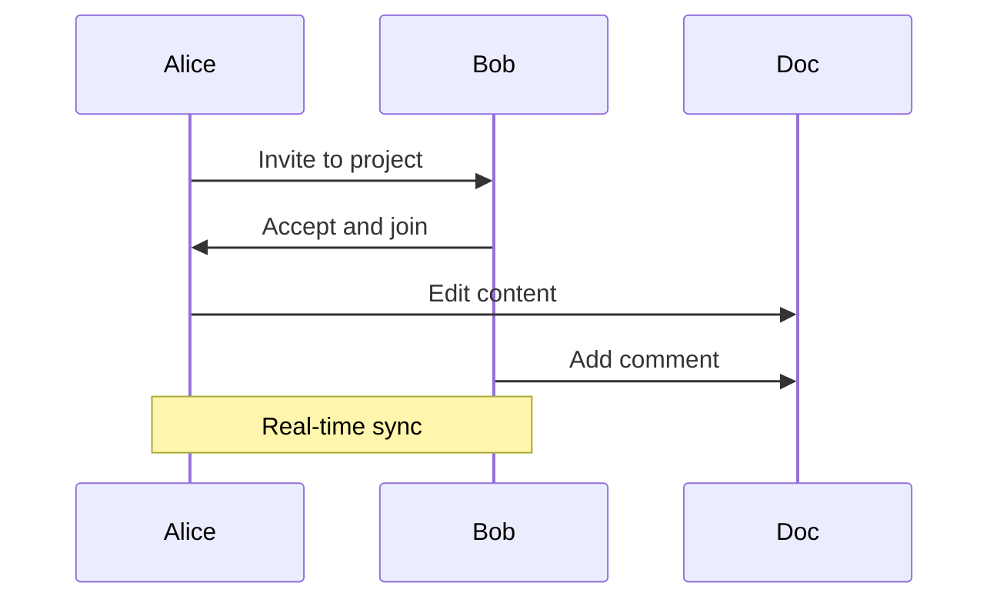

## Inviting Team Members

You invite collaborators to join your documentation space easily. Assign roles like viewer, editor, or admin to control access. Invitations send via email with secure links.

<Callout kind="success">
  Role-based access prevents unauthorized changes.
</Callout>

## Real-Time Editing

Work together simultaneously on documents. Changes appear instantly for all users.

<Steps>
  <Step title="Share Link" icon="share-2">
    Generate a shareable link for specific pages or the entire project.
  </Step>
  <Step title="Join Session" icon="users">
    
    ```javascript
    // Join collaboration session
    const sessionId = 'abc123';
    const user = { name: 'John', role: 'editor' };
    fetch(`/api/sessions/${sessionId}/join`, {
      method: 'POST',
      body: JSON.stringify(user)
    });
    ```
  </Step>
  <Step title="Resolve Conflicts" icon="alert-circle">
    Use the merge tool for overlapping edits.
  </Step>
</Steps>

## Comments and Feedback

Facilitate discussions directly on content.

<Tabs>
  <Tab title="Inline Comments" icon="message-square">
    Highlight text and add comments for targeted feedback.
    
    ```javascript
    // Add comment API
    fetch('/api/comments', {
      method: 'POST',
      body: JSON.stringify({
        pageId: '456',
        text: 'Suggestion here',
        position: { line: 10 }
      })
    });
    ```
  </Tab>
  <Tab title="Notifications" icon="bell">
    Receive alerts for mentions and updates.
    
    ```javascript
    // Notification setup
    const prefs = { email: true, inApp: true };
    fetch('/api/notifications', { method: 'PATCH', body: JSON.stringify(prefs) });
    ```
  </Tab>
</Tabs>

<Columns cols={2}>
  <Card title="Version History" icon="git-branch" href="#">
    Revert to previous versions if needed.
  </Card>
  <Card title="Approval Workflow" icon="check-circle" href="#">
    Require approvals before publishing.
  </Card>
</Columns>

## External Sharing

Share docs outside your team securely.

<ExpandableGroup>
  <Expandable title="Public Links" default-open="false">
    Create read-only links for stakeholders. Set expiration dates for temporary access.
  </Expandable>
  <Expandable title="Embed Options">
    Embed pages in websites or tools like Notion.
  </Expandable>
  <Expandable title="Export for Review">
    Download as PDF for offline feedback sessions.
  </Expandable>
</ExpandableGroup>



Collaboration in aishwarya enhances productivity. Leverage these tools for seamless teamwork.