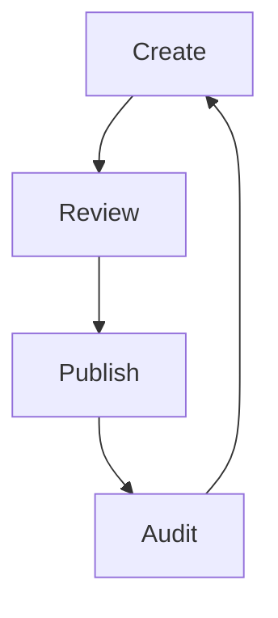

## Document Structure

You maintain effective documentation by establishing a clear hierarchy. Folders and subpages help categorize content logically. Regularly review and update structures as projects evolve.

<Columns cols={3}>
  <Card title="Hierarchy" icon="layers" href="#">
    Use nested folders for complex topics.
  </Card>
  <Card title="Tagging" icon="tag" href="#">
    Assign tags for quick filtering and search.
  </Card>
  <Card title="Versions" icon="git-branch" href="#">
    Track changes with built-in version control.
  </Card>
</Columns>

## Editing Workflow

Implement a consistent editing process to ensure quality.

<Steps>
  <Step title="Draft Pages" icon="edit">
    Create drafts for review before publishing.
    
    ```javascript
    // Draft API example
    const draft = {
      content: 'Draft text',
      status: 'pending'
    };
    fetch('/api/pages/draft', { method: 'POST', body: JSON.stringify(draft) });
    ```
  </Step>
  <Step title="Review Changes" icon="eye">
    Collaborate on reviews using comments and suggestions.
  </Step>
  <Step title="Publish" icon="upload">
    Approve and publish once verified.
  </Step>
</Steps>

<Callout kind="alert">
  Always backup important changes before major updates.
</Callout>

## Search and Indexing

Optimize your docs for discoverability.

<Tabs>
  <Tab title="Full-Text Search" icon="search">
    Enable search across all pages and attachments.
    
    ```javascript
    // Search query
    const results = await fetch('/api/search?q=keyword');
    const data = await results.json();
    console.log(data.hits);
    ```
  </Tab>
  <Tab title="Advanced Filters" icon="filter">
    Filter by tags, dates, or authors for precise results. 
    
    ```javascript
    // Filtered search
    fetch('/api/search?tag=guide&date=>2024-01-01');
    ```
  </Tab>
</Tabs>

## Maintenance Best Practices

Keep your documentation current and relevant.

<ExpandableGroup>
  <Expandable title="Regular Audits" default-open="true">
    Schedule monthly reviews to remove outdated content. Update links and examples as needed. 
  </Expandable>
  <Expandable title="Analytics Integration">
    Track page views to identify popular sections. Use insights to prioritize updates.
  </Expandable>
  <Expandable title="Export Options">
    Generate reports in various formats for archiving or sharing.
  </Expandable>
</ExpandableGroup>



Effective management ensures your documentation serves as a reliable resource. Apply these strategies to streamline your workflow.